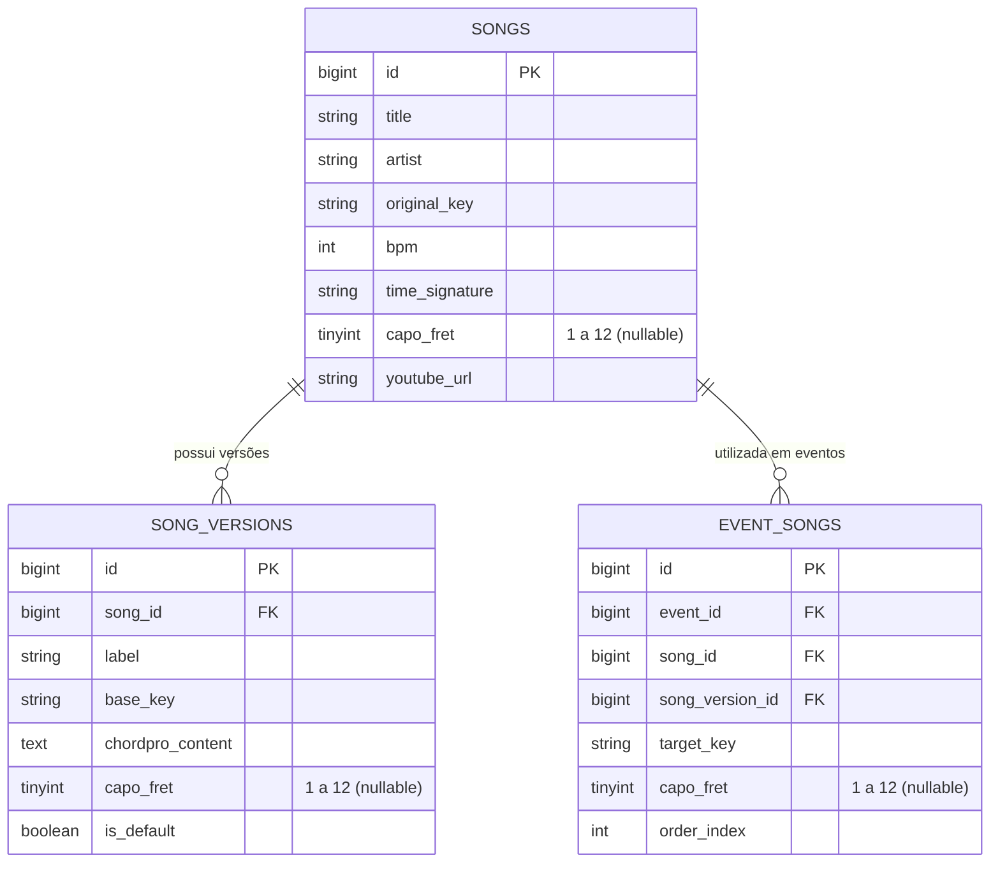
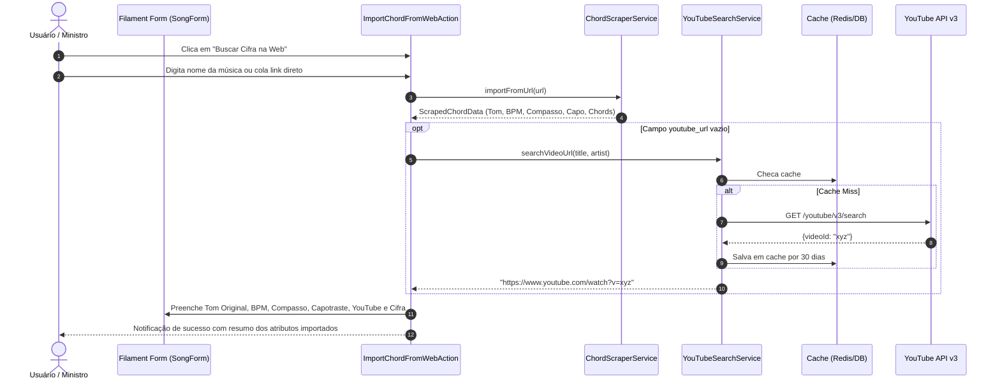

# Arquitetura: Suporte ao Capotraste e Integração com YouTube API

Esta documentação descreve as decisões de design, modelo de dados, fluxos de integração e estratégias de cache para o suporte a **Capotraste (Capo)** e para a integração com a **API do YouTube** no Cifraly.

---

## 1. Visão Geral

O objetivo desta arquitetura é enriquecer a experiência dos líderes de louvor e músicos do palco com dados musicais precisos e automação na curadoria de cifras:
1. **Identificação e Suporte ao Capotraste**: Reconhece automaticamente o uso de capotraste a partir de fontes na Web (ex.: Cifra Club), armazena a informação nas entidades de músicas, versões e eventos, e exibe de forma destacada no Modo Palco para os instrumentistas.
2. **Integração com YouTube Data API v3**: Durante a importação de cifras via Web, busca automaticamente o vídeo oficial ou execução de referência da música no YouTube, preenchendo o link correspondente (`youtube_url`) com cache de longa duração (30 dias) para economizar quotas da API do Google.

---

## 2. Arquitetura do Suporte ao Capotraste

### 2.1. Modelo de Dados

A informação de capotraste é representada pelo campo `capo_fret` (inteiro de 1 a 12, indicando o traste/casa onde o capotraste é posicionado):

- `songs.capo_fret`: Capotraste padrão da música (definido no cadastro).
- `song_versions.capo_fret`: Permite que versões/arranjos alternativos de uma mesma música possuam posições de capotraste distintas.
- `event_songs.capo_fret`: Permite que uma escala específica em um evento personalize a casa do capotraste caso o ministro altere a afinação ou a execução naquele culto.



### 2.2. Extração via Web Scraping

Os drivers de raspagem de cifras (`CifraClubDriver` e `GenericHtmlDriver`) realizam a extração do capotraste através de três camadas de análise:
1. **RSC JSON (Next.js SSR payload)**: Analisa `\"capo\": (\d+)` nos scripts de hidratação do Cifra Club.
2. **Seletores HTML e Containers**: Inspeciona tags com `id="cifra_capo"`, `id="capo"` e botões de interface.
3. **Padrões Textuais**: Regex que reconhece menções na cifra bruta como `Capotraste na Xª casa` ou `Capo: X`.

O valor é encapsulado no DTO imutável `ScrapedChordData` (`public ?int $capoFret = null`) e repassado para a interface Filament através da action `ImportChordFromWebAction`.

### 2.3. Exibição no Modo Palco

No `StageView` Livewire, o capotraste é resolvido com precedência:
`$selectedEventSong->capo_fret ?? $selectedEventSong->songVersion?->capo_fret ?? $selectedEventSong->song?->capo_fret`.

Quando presente:
- **Barra de Metadados**: Exibe um badge temático com ícone de violão `🎸 Capo: Xª casa` com alta visibilidade para os músicos.
- **Gaveta do Repertório (Setlist Drawer)**: Exibe a etiqueta `Capo X` na lista lateral de músicas.

---

## 3. Integração com a API do YouTube (YouTube Data API v3)

### 3.1. Arquitetura do Serviço `YouTubeSearchService`

O serviço `App\Services\Music\YouTubeSearchService` centraliza todas as interações com a API do YouTube v3.

```
[ImportChordFromWebAction]
          │
          ▼
[YouTubeSearchService::searchVideoUrl($title, $artist)]
          │
          ├──> [Cache Layer (Key: youtube_search:{md5(query)}, TTL: 30 dias)]
          │           │
          │           ├── (Hit) ──> Retorna URL em cache
          │
          └──> (Miss) ──> [Google YouTube Data API v3]
                              GET /youtube/v3/search?part=snippet&type=video&maxResults=1&q={artist - title}&key={key}
                                     │
                                     ├── (Sucesso) ──> Retorna "https://www.youtube.com/watch?v={videoId}" e salva no Cache
                                     └── (Falha / Sem cota / Sem chave) ──> Registra Log e retorna null (sem quebrar a requisição)
```

### 3.2. Configuração de Credenciais

- Configurado em `config/services.php`:
  ```php
  'youtube' => [
      'key' => env('YOUTUBE_API_KEY'),
  ],
  ```
- Variável no `.env.example`: `YOUTUBE_API_KEY=`

### 3.3. Otimização de Quota da API

A YouTube Data API v3 possui limite de quota diária (normalmente 10.000 unidades, onde uma pesquisa consome cerca de 100 unidades). Para garantir escalabilidade e custo zero:
1. **Cache Persistente de 30 Dias**: Músicas frequentemente importadas ou editadas não realizam novas chamadas ao Google.
2. **Resiliência a Falhas (Fault Tolerance)**: Se a chave não estiver configurada ou a cota esgotar, a importação da cifra continua normalmente, informando o usuário e preenchendo os demais campos.
3. **Query Otimizada**: A query concatena `"{Artista} - {Título}"` e filtra exclusivamente por `type=video&maxResults=1`.

---

## 4. Fluxo Completo de Importação


